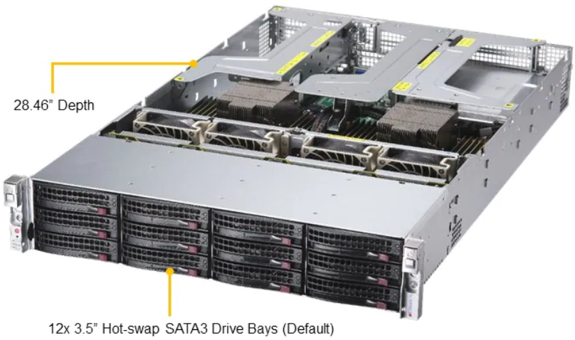
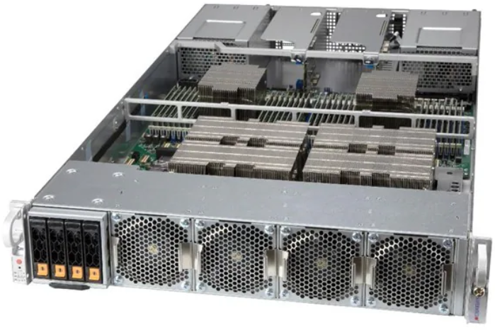
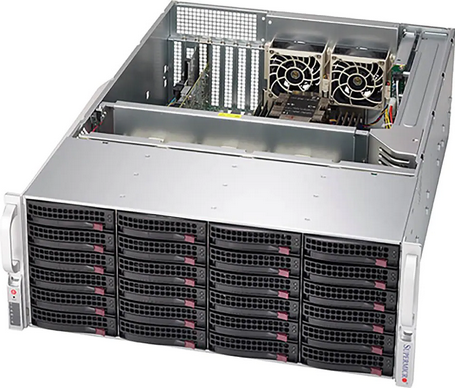

**********
Introdução
**********

.. contents:: Conteúdo

.. Warning::
   Esta documentação é um trabalho contínuo e algumas seções podem estar incompletas. Entretanto, 
   a equipe de suporte do AESOP está à disposição para esclarecer eventuais dúvidas dos usuários.

.. Note::
    **AESOP - Sistema de Alerta Precoce para Surtos com Potencial Epi-Pandêmico**

    A iniciativa tem o apoio do Ministério da Saúde (MS), da Fundação Rockefeller e da Fiocruz. 
    Atualmente em desenvolvimento, o AESOP é projetado para sinalizar novos surtos de doenças 
    com potencial para causar emergências de saúde, uma ocorrência cada vez mais comum devido 
    às mudanças climáticas, crescimento populacional e migração.
    O projeto visa desenvolver um sistema de detecção de risco de epidemias de doenças virais 
    respiratórias em municípios brasileiros, com base em informações continuamente registradas 
    em base de dados governamentais.

Introdução
==========
Para facilitar o desenvolvimento do projeto AESOP utiliza-se um Cluster que possui nós computacionais 
que permite atender tanto a demanda de processamento com CPUs e GPUs.

Segue uma breve especificação de hardware dos principais equipamentos que compõem o Cluster AESOP.

FAT Node
--------

.. list-table:: FAT Node (2 nodes)
    :align: center
    :header-rows: 1

    * - Model
      - A+ Server 2024US-TRT 
    * - Processador
      - AMD EPYC 7713 (64 cores/socket)
    * - Cores/Node
      - 128
    * - Threads/core
      - 2
    * - Clock rate
      - 3100 GHz
    * - Memória
      - 4 TB 
    * - Rede
      - 25 GbE
    * - Scratch (Local)
      - 28 TB

GPU Node
--------

.. list-table:: GPU Node (1 node)
    :align: center
    :header-rows: 1

    * - Model
      - A+ Server 2124GQ-NART+ 
    * - Processador
      - AMD EPYC 7713 (64 cores/socket)
    * - Cores/Node
      - 128
    * - Threads/core
      - 2
    * - Clock rate
      - 2000 GHz
    * - Memória
      - 2 TB 
    * - GPU
      - NVIDIA HGX A100 4-GPU 40GB
    * - Rede
      - 25 GbE
    * - Scratch (Local)
      - 28 TB

Storage Node
------------

.. list-table:: Storage Node (1 node)
    :align: center
    :header-rows: 1

    * - Model
      - Storage SuperServer SSG-640P-E1CR24H 
    * - Processador
      - Intel(R) Xeon(R) Silver 4310
    * - Cores/Node
      - 12
    * - Threads/core
      - 2
    * - Clock rate
      - 2100 GHz
    * - Memória
      - 256 GB 
    * - Rede
      - 25 GbE
    * - Total de armazenamento
      - 160 TB

